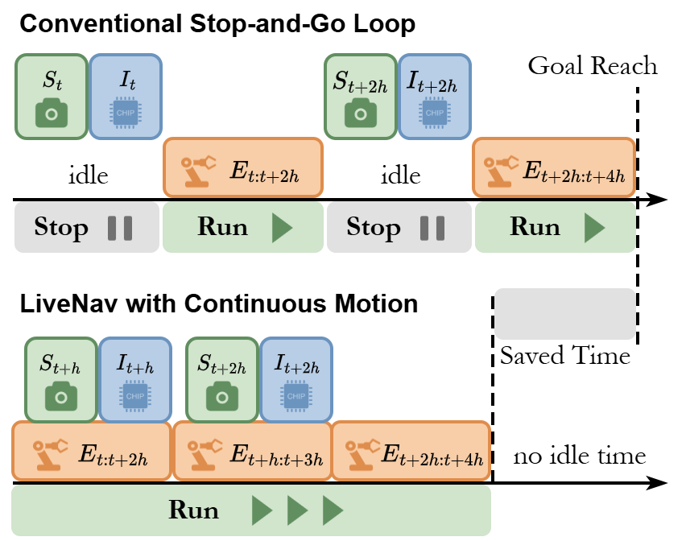
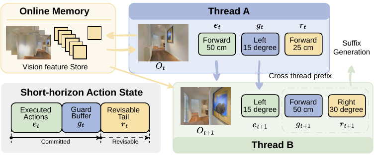

<div align="center">
  <h1>LiveNav: Breaking the Stop-and-Go Loop in Embodied Navigation</h1>
  <!-- <p><em>A training-free runtime framework for continuous online vision-language navigation</em></p> -->
</div>

<p align="center"><em>Same navigator, cleaner runtime behavior: LiveNav keeps actions available while the robot is moving.</em></p>

<p align="center">
  ⚡ Training-free &nbsp;&nbsp;|&nbsp;&nbsp; 🔄 Async handoff 
</p>

LiveNav keeps robots moving while future actions are refreshed online. It wraps pretrained VLN/VLM navigators at runtime, so you can improve motion continuity without retraining the backbone.

<p align="center">
  
</p>

## ✨ Overview

Many strong VLN systems still follow a blocking **observe -> generate -> act** loop. In deployment, this creates visible pauses: the robot stops, waits for the next inference round, and only then continues.

**LiveNav** removes that stop-and-go behavior with a runtime-only interface:

- **Training-free**: attach it to compatible pretrained navigators.
- **Continuous execution**: execute the committed prefix while the next chunk is refreshed in parallel.
- **Revisable future actions**: keep a safe guard buffer and update the remaining tail using new observations.

LiveNav preserves navigation performance while improving continuity, with up to **77.7% less waiting time** in real-world streaming deployment.


<p align="center">
  
</p>

<p align="center"><em>Converted from <code>StreamVLN/paper/fig/livenav_overview.pdf</code>: LiveNav keeps a committed executable prefix while the revisable tail is refreshed asynchronously with online memory.</em></p>

## 🚀 Quick Start

### Environment

The setup is largely aligned with [NaVIDA](https://github.com/waynechu1021/NAVIDA), and reusing the same environment is recommended.

- Python 3.10
- CUDA 11.8+
- Habitat-Sim 0.2.4
- Habitat-Lab 0.2.4
- PyTorch / Transformers / PEFT
- `qwen_vl_utils`, `vllm`, `flash-attn`

### Data and Checkpoints

Following [NaVIDA](https://github.com/waynechu1021/NAVIDA), the expected layout is the standard Habitat VLN-CE structure:

```text
data/
├── scene_datasets/
├── R2R_VLNCE_v1-3_preprocessed/
└── ...
```

Download weights of [StreamVLN](https://huggingface.co/mengwei0427/StreamVLN_Video_qwen_1_5_r2r_rxr_envdrop_scalevln_v1_3) and [NaVIDA](https://huggingface.co/waynechu/NaVIDA).


## 🤖 Real-World Demo

Useful entry points:

- `real_world_demo/agent_service_live.py`: local Flask action service
- `real_world_demo/real_world_vln_live.py`: RGB-D + robot control client

> 📍 Update the endpoint and device settings before deployment in your own robot environment.


```bash
cd real_world_demo
bash run.sh # on server
python3 real_world_vln_live.py # on robot
```


## 🙏 Acknowledgements

This repository builds on or reuses ideas/code from:

- [NaVIDA](https://github.com/waynechu1021/NAVIDA)
- [StreamVLN](https://github.com/InternRobotics/StreamVLN)
- [Habitat](https://github.com/facebookresearch/habitat-sim)
