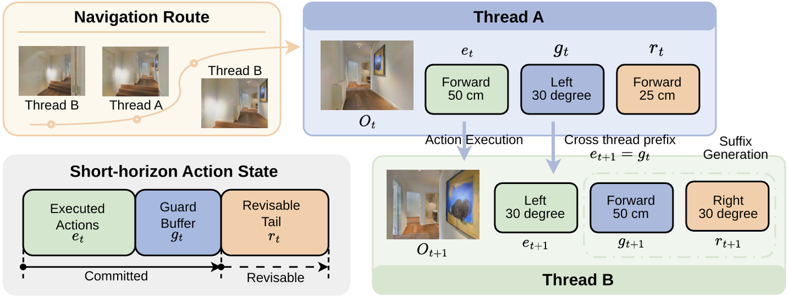
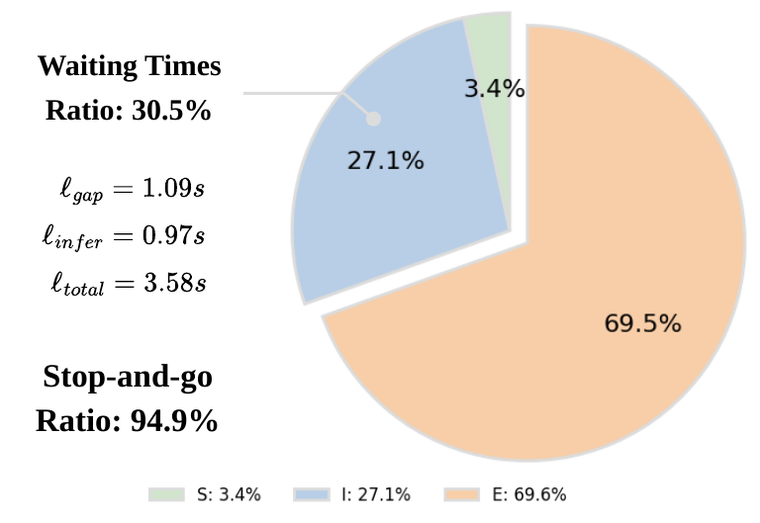
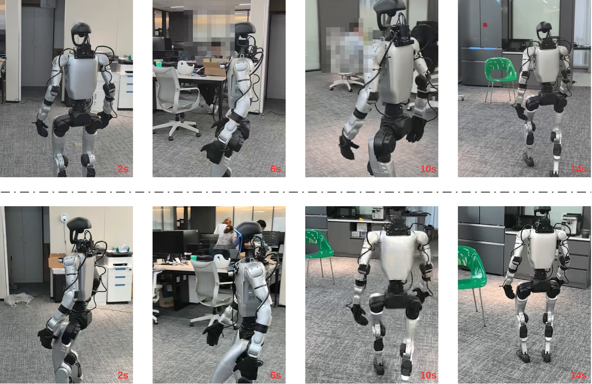

<div align="center">
  <h1>LiveVLN: Breaking the Stop-and-Go Loop in Vision-Language Navigation</h1>
</div>

<p align="center"><em>A training-free runtime framework that keeps actions continuously available during embodied VLN deployment.</em></p>

<p align="center">
  <a href="https://arxiv.org/abs/2604.19536">
    
  </a>
</p>
<p align="center">
  ⚡ Training-free &nbsp;&nbsp;|&nbsp;&nbsp; 🔄 Guarded handoff &nbsp;&nbsp;|&nbsp;&nbsp; 🧠 Real-time adaptation
</p>


<p align="center">
  
</p>

LiveVLN is a runtime wrapper for compatible pretrained VLM based navigators. Instead of exposing the robot to a blocking **sense-inference-execution** loop, it overlaps execution with background refresh so the next action chunk is ready before the committed prefix is exhausted.

## ✨ Overview

Previous strong VLN systems still deploy with a blocking **sense → inference → execution** interface. Thus the robot visibly pauses because motion must wait for sensing, transmission, and inference to finish before the next continuation arrives.

**LiveVLN** removes that stop-and-go loop at runtime with a dual-thread interface:

- **Guarded handoff**: keep executing a committed guard buffer while the next continuation is refreshed in the background.
- **Revisable tail**: expose only the minimal safe prefix and keep later actions editable under new observations.
- **Real-time adaptation**: resize the guard budget from recent sense-inference latency instead of using a fixed horizon.
- **Training-free integration**: wrap the same pretrained checkpoint without retraining the backbone.

<p align="center">
  
</p>

<p align="center"><em>LiveVLN keeps a short committed prefix for continuous motion, while the remaining tail stays revisable under new observations.</em></p>

## 📌 Why it matters

The core issue is **runtime exposure**: if inference latency is directly exposed to the controller, the robot pauses even when the policy is strong.

On a real NaVIDA deployment, native blocking execution spends:

- **10.64s waiting per episode**
- **30.5% waiting ratio**
- **94.9% stop-and-go rounds**

LiveVLN hides that latency behind committed execution, so motion stays available while the next continuation is refreshed.

<p align="center">
  
</p>

## 📊 Results 
Across **R2R**, **RxR**, and real-robot streaming, LiveVLN keeps benchmark performance close to the original checkpoints while substantially improving continuity:

- **StreamVLN**
  - waiting time: **7.32s → 1.63s** (**77.7%↓**)
  - wall-clock episode time: **41.98s → 36.71s** (**12.6%↓**)
  - pause count: **6.75 → 0.80**
- **NaVIDA**
  - waiting time: **10.64s → 2.89s** (**72.8%↓**)
  - wall-clock episode time: **34.90s → 28.06s** (**19.6%↓**)
  - pause count: **9.25 → 1.20**


<!-- <p align="center">
  
</p>

<p align="center"><em>Under the same deployment setup and wall-clock budget, LiveVLN moves more continuously and progresses more efficiently.</em></p> -->

## 🚀 Quick Start

### Environment

The setup is largely aligned with [NaVIDA](https://github.com/waynechu1021/NAVIDA), and reusing the same environment is recommended.

- Python 3.10
- CUDA 11.8+
- Habitat-Sim 0.2.4
- Habitat-Lab 0.2.4
- PyTorch / Transformers / PEFT
- `qwen_vl_utils`, `vllm`, `flash-attn`

### Data and Checkpoints

Following [NaVIDA](https://github.com/waynechu1021/NAVIDA), the expected layout is the standard Habitat VLN-CE structure:

```text
data/
├── scene_datasets/
├── R2R_VLNCE_v1-3_preprocessed/
└── ...
```

Download weights of [StreamVLN](https://huggingface.co/mengwei0427/StreamVLN_Video_qwen_1_5_r2r_rxr_envdrop_scalevln_v1_3) and [NaVIDA](https://huggingface.co/waynechu/NaVIDA).

## 🤖 Real-World Demo

Useful entry points:

- `real_world_demo/agent_service_live.py`: local Flask action service
- `real_world_demo/real_world_vln_live.py`: RGB-D + robot control client

> 📍 Update the endpoint and device settings before deployment in your own robot environment.

```bash
# For NaVIDA demo
cd real_world_demo
bash start_server.sh   # on server
python3 real_world_vln_live.py   # on robot
```

## 🙏 Acknowledgements

This repository builds on or reuses ideas/code from:

- [NaVIDA](https://github.com/waynechu1021/NAVIDA)
- [StreamVLN](https://github.com/InternRobotics/StreamVLN)
- [Habitat](https://github.com/facebookresearch/habitat-sim)
